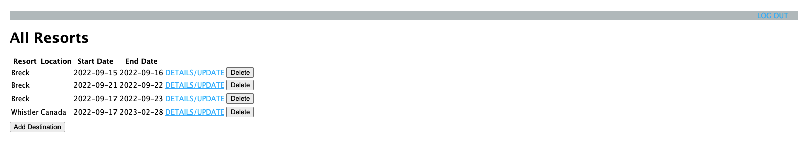
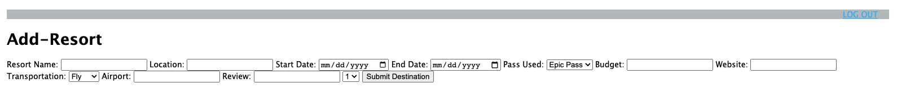
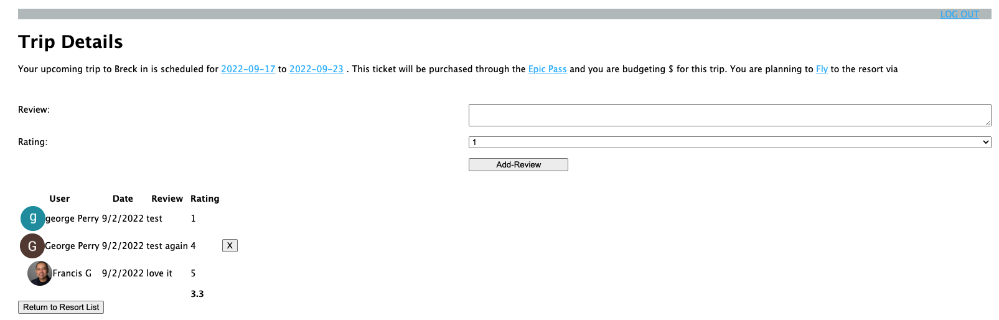
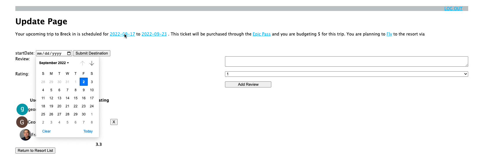

# Ski Trip Planner

A web application designed to help you plan your upcoming ski trips with helpful resources, resort reviews, and trip organization functionality

## Project Requirements

1. Have at least two data entities
2. Display a one:many or many:many relationship (embedded or referenced)
3. Use OAuth authentication
4. Implement basic authorization that restricts access to features that require a logged in user by protecting those routes from anonymous users using the isLoggedIn middleware
5. Edit and deletion of data can only be done by the user that created the data
6. Develop a full-CRUD data operation
7. Deployed on Heroku

## Technologies Used:

- JavaScript
- Node js
- Express
- Mongoose
- MongoDB
- OAuth
- Google People API
- Heroku

## Getting Started:

[Link to app](https://ski-planner-2.herokuapp.com/)
[Link to Trello](https://trello.com/b/AzrYyyFy/project-2-ski-planner)

## App Screenshots:

Below: This view shows a list of all potential ski trips created by a user

Below: This page renders input fields allowing the user to create a new ski trip

Below: This page showcases additional details associated with the trip which are not displayed on the "All-Resorts" page (e.g, amount budgeted). Here, the user has the ability to either add a review for the resort or see previous reviews from other users. A user may delete a review if they were the one who created it.

Below: A user may update the information they inputed regarding a planned ski trip by clicking on a hyperlink. In this example, a new input field will appear and allow the user to select a different start date for this trip.

## Project Hurdles

- One of the most challenging hurdles early on was developing a framework to organize all of the information (i.e., a piece class vs. a board class, creating methods for a class vs. creating independent functions). Once I came up with a way to structure the information by piece through the creation of a piece class, I could easily store attributes such as a piece's square location, its color, whether or not it had moves available, and whether or not it was a king.

- The situation that took the most time to develop an algorithm for was the double+ jump. I wanted to create an algorithm which would allow for consecutive captures infinitely until there were no longer moves available. By adding conditions to the event listner placed on the board, I was able to continually call the showDoubleJumpPosition() method (which would show the available squares) until there were no longer moves available for that piece object.

- Attention to detail was crucial throughout this project as I had to think of every possible scenario. This would all change if a piece was a king or if an object was on the first or last row of the board. Constantly testing the game to ensure I wasn't missing a possiblity was a very important part of overcoming the bugs I encountered along the way. One very helpful feature I added towards the end of the project was the initTest() function, which would render the board with fewer pieces, allowing me to test win scenarios more efficiently.

## Next steps:

- [Link to Github Repository](https://github.com/georgeperryv/Project_2_SkiResort-Planner)
- Further develop the design layout
- Add helpful resources for researching ski resorts to the resources page
- Link to a Google Calendar API that allows a user to sync their trips to their personal calendar

## Other sources:

- [Psuedocode Google Sheets Link](https://docs.google.com/document/d/1FbWRw0gCfQjVgFh1uhNTGq_Qw5s3QujQxh4pUrToHSw/edit)

- [Wireframe: Website Layout](https://whimsical.com/project-2-ski-planner-s9vXe2NJzEB9QgMaPhsQb)

- Sources: Occasionally referenced Stack Overflow, MDN, W3 School, https://stackoverflow.com/questions/1531093/how-do-i-get-the-current-date-in-javascript#:~:text=Use%20new%20Date()%20to,the%20current%20date%20and%20time.&text=This%20will%20give%20you%20today's,to%20whatever%20format%20you%20wish.
